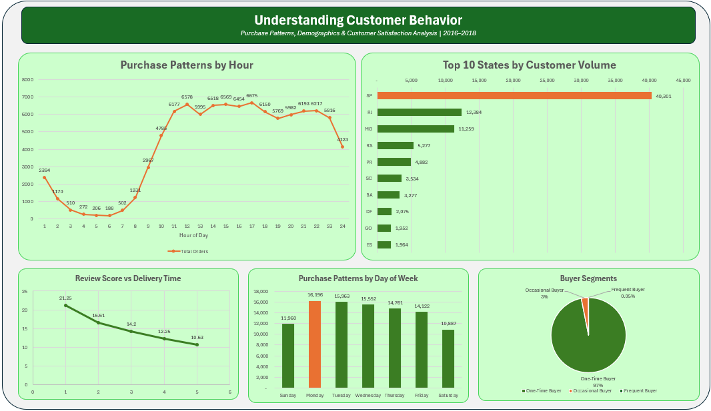
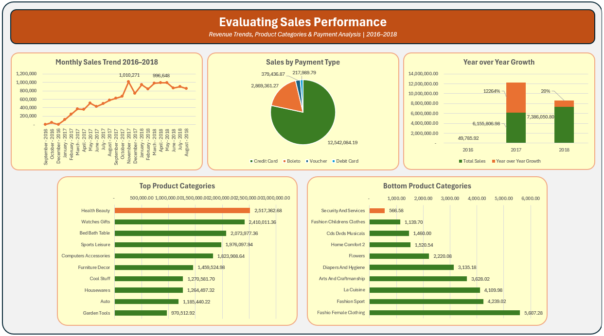
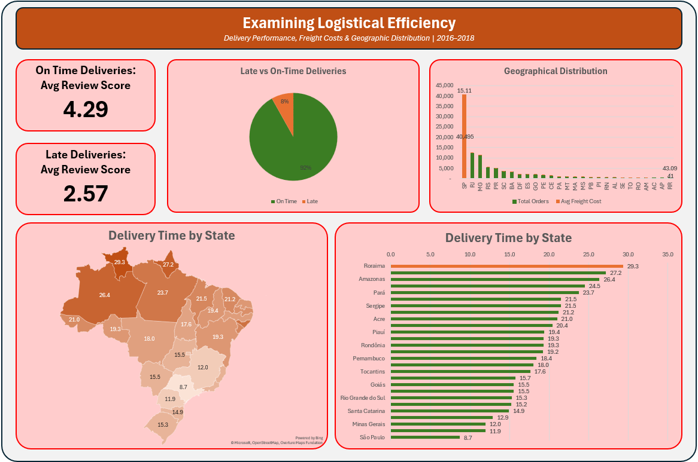

# 🛒 Olist Brazilian E-Commerce Analysis

## 📌 Overview
A comprehensive data analysis of the Olist Brazilian 
E-Commerce dataset covering 100,000+ orders from 
2016 to 2018.

## 🎯 Objectives
1. Understand Customer Behavior
2. Evaluate Sales Performance
3. Examine Logistical Efficiency

## 🛠️ Tools Used
- **MySQL 8.0** — Data extraction and analysis
- **Microsoft Excel** — Data visualization

## 📊 Key Findings
- 97% of customers are one-time buyers
- Revenue grew 19.99% from 2017 to 2018
- Health Beauty is the top category at R$2.5M
- Late deliveries cause 40% drop in review scores
- São Paulo delivers in 8.7 days vs 29.3 days in Roraima

## 📁 Files
| File | Description |
|---|---|
| `Import_script.sql` | MySQL table creation and data import |
| `Case_Study_script.sql` | Analysis queries for all 3 objectives |
| `Case_Study_Report.pdf` | Full report with visualizations |

## 📈 Dashboard Preview

## 🔗 Dataset Source
[Olist Brazilian E-Commerce on Kaggle](https://www.kaggle.com/datasets/olistbr/brazilian-ecommerce)
